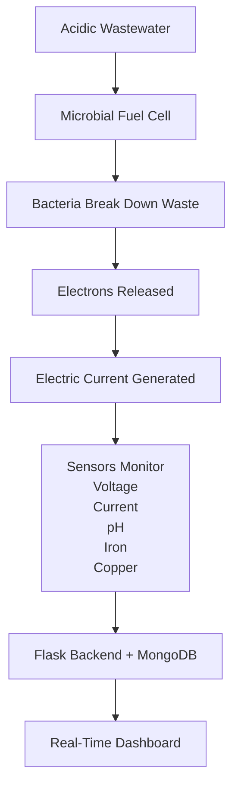
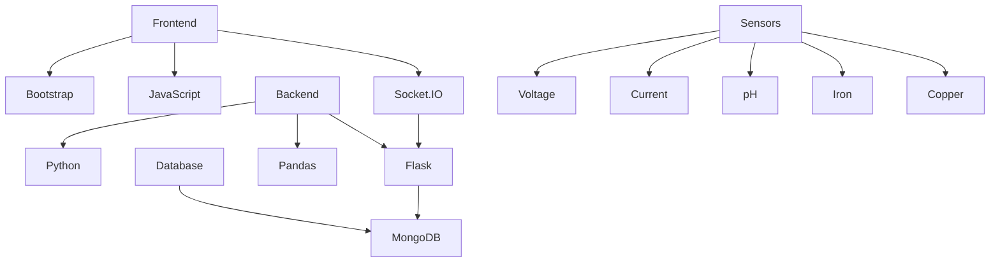
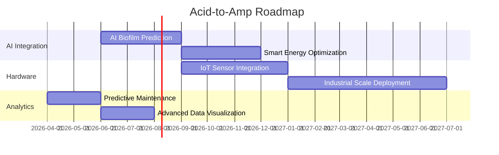

# ⚡ Acid-to-Amp: Bioelectric Intelligence Platform

<div align="center">


**Transforming acidic wastewater into renewable electricity using Microbial Fuel Cell (MFC) technology**

</div>

---

## 🌍 Project Overview

<p align="center">


</p>

**Acid-to-Amp** is a next-generation **green technology platform** that converts **acidic wastewater** into **electrical energy** using **Microbial Fuel Cell (MFC)** technology.

The system combines:

* Bioelectrochemistry
* Real-time sensor monitoring
* Data analytics
* Sustainable environmental engineering

to transform **industrial waste into renewable energy**.

---

<div align="center">


</div>

---

# 🧬 How It Works



---

# 🚀 Key Features

| Feature                   | Description                                                      |
| ------------------------- | ---------------------------------------------------------------- |
| ⚡ Bioelectric Generation  | Converts acidic waste → electricity using electroactive bacteria |
| 📊 Real-Time Monitoring   | Live voltage, current, biofilm activity tracking                 |
| 🧪 Environmental Sensors  | pH, Iron, Copper concentration monitoring                        |
| 🖥️ Interactive Dashboard | Real-time analytics & visualizations                             |
| 📁 Data Export            | CSV, Excel, JSON formats                                         |

---

# 🛠 Technology Stack



---

# 📂 Project Structure

```
acid_to_amp/
│
├── app.py                 # Main Flask application
├── models.py              # MongoDB models
├── dashboard.py           # Dashboard logic
├── config.py              # Configuration
├── requirements.txt       # Dependencies
│
├── templates/
│   ├── index.html
│   ├── dashboard.html
│   ├── charts.html
│   └── system.html
│
├── static/
│   ├── css/
│   ├── js/
│   └── images/
│
└── README.md
```

---

# ⚙ Quick Start

```bash
# Clone repository
git clone https://github.com/YOUR_USERNAME/acid-to-amp.git

# Enter project
cd acid-to-amp

# Install dependencies
pip install -r requirements.txt

# Run the server
python app.py
```

Open in browser:

```
http://localhost:5000
```

---

<div align="center">


</div>

---

# 🌱 Environmental Impact

🌍 **Pollution Reduction**
Converts toxic acidic wastewater into energy.

⚡ **Renewable Energy**
Generates clean micro-energy from waste.

🏭 **Industrial Solution**
Provides sustainable wastewater management.

🔬 **Research Platform**
Advances bioelectrochemical research.

---

# 🔮 Future Roadmap



---

# 👨‍💻 About the Developer

**Shekhar Pandey**
Developer & Sustainability Innovator

Combining **software engineering, bioelectrochemistry, and green technology** to solve environmental challenges.

---

<div align="center">

<a href="https://github.com/YOUR_USERNAME">

</a>

<a href="https://www.linkedin.com/in/YOUR_LINKEDIN">

</a>

</div>

---

# ⭐ Support the Project

If you find this project valuable:

⭐ Star this repository
🍴 Fork and contribute
🐛 Report issues
📢 Share with researchers & innovators

---

<div align="center">

### ⚡ From Acid to Amp — Turning Waste Into Watts ⚡

Made with ❤️ for a sustainable future

</div>
